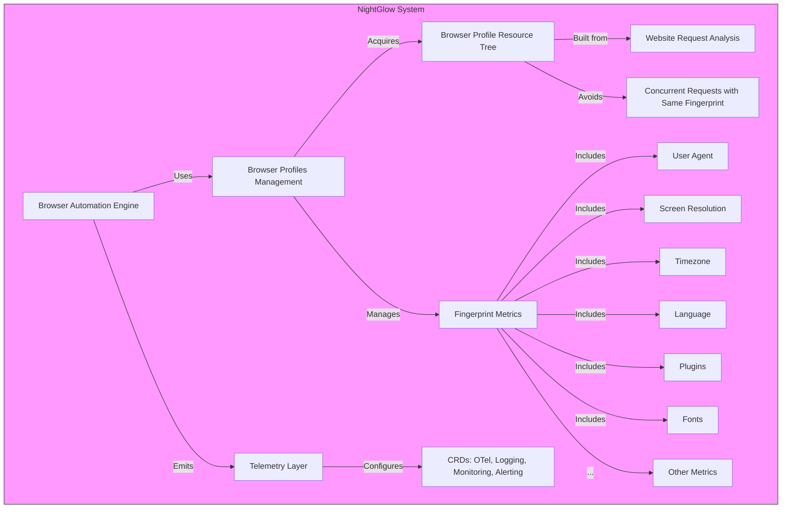

# NightGlow - Cloud-first stealth browser for scraping and browser automation
The system should have extensive telemetry capabilities (otel, logging, monitoring, alerting) configured through CRDs. There should be explicit browser profiles management (every possible fingerprint metric, including but not limited to: user agent, screen resolution, timezone, language, plugins, fonts, and more). Built-in acquire mechanism for browser profiles against a resource tree (built from requests any given website makes like google/facebook analytics) to avoid concurrent requests with the same fingerprint.

