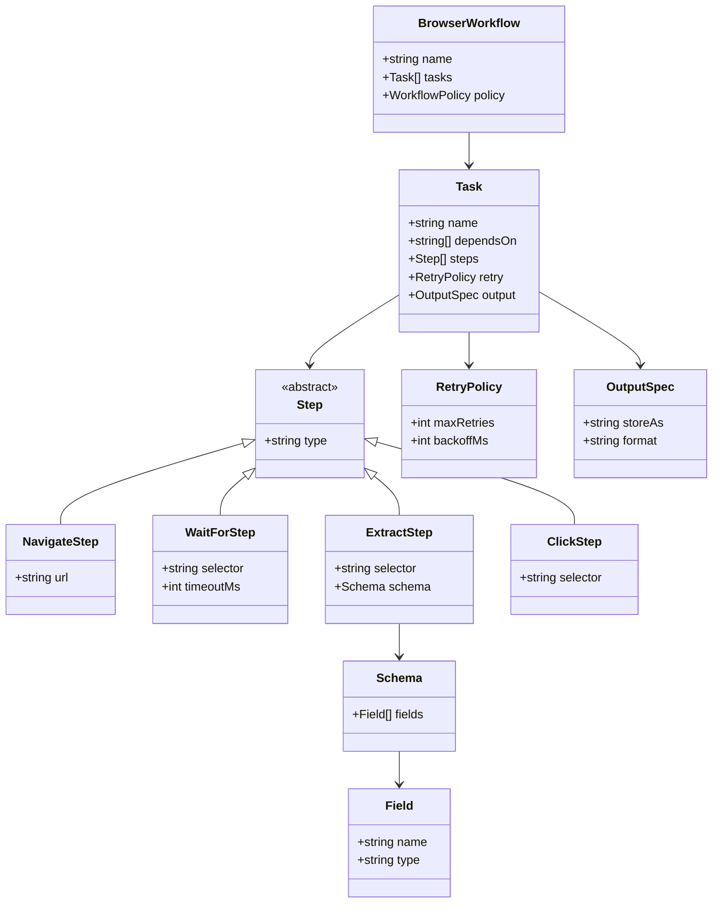
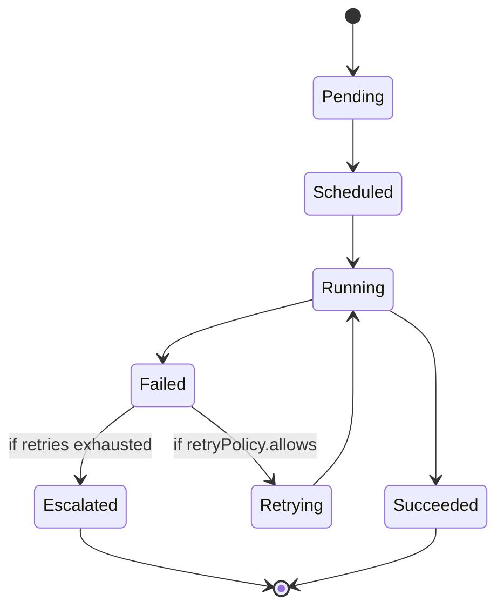
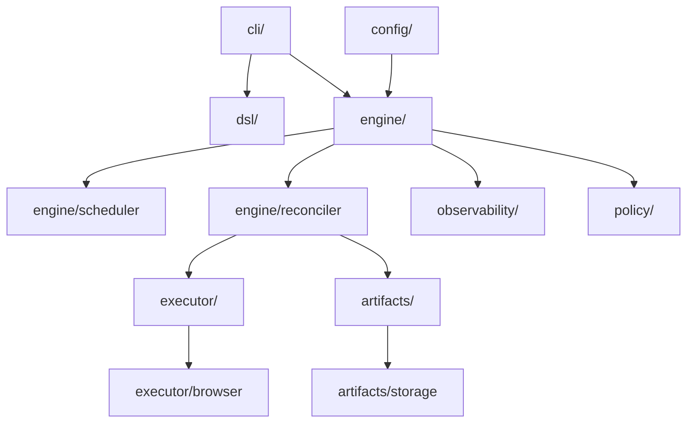

# Minimal DSL Schema

```mermaid
classDiagram
    class BrowserWorkflow {
        +string name
        +Task[] tasks
        +WorkflowPolicy policy
    }

    class Task {
        +string name
        +string[] dependsOn
        +Step[] steps
        +RetryPolicy retry
        +OutputSpec output
    }

    class Step {
        <<abstract>>
        +string type
    }

    class NavigateStep {
        +string url
    }

    class WaitForStep {
        +string selector
        +int timeoutMs
    }

    class ExtractStep {
        +string selector
        +Schema schema
    }

    class ClickStep {
        +string selector
    }

    class Schema {
        +Field[] fields
    }

    class Field {
        +string name
        +string type
    }

    class RetryPolicy {
        +int maxRetries
        +int backoffMs
    }

    class OutputSpec {
        +string storeAs
        +string format
    }

    BrowserWorkflow --> Task
    Task --> Step
    Step <|-- NavigateStep
    Step <|-- WaitForStep
    Step <|-- ExtractStep
    Step <|-- ClickStep
    ExtractStep --> Schema
    Schema --> Field
    Task --> RetryPolicy
    Task --> OutputSpec
```

# Formal Reconciliation State Machine

```mermaid
stateDiagram-v2
    [*] --> Pending

    Pending --> Scheduled
    Scheduled --> Running

    Running --> Succeeded
    Running --> Failed

    Failed --> Retrying : if retryPolicy.allows
    Retrying --> Running

    Failed --> Escalated : if retries exhausted

    Escalated --> [*]
    Succeeded --> [*]
```
# Internal Folder / Module Structure

```mermaid
flowchart TB
    CLI["cli/"]
    DSL["dsl/"]
    Engine["engine/"]
    Scheduler["engine/scheduler"]
    Reconciler["engine/reconciler"]
    Executor["executor/"]
    Browser["executor/browser"]
    Artifacts["artifacts/"]
    Storage["artifacts/storage"]
    Observability["observability/"]
    Policy["policy/"]
    Config["config/"]

    CLI --> DSL
    CLI --> Engine

    Engine --> Scheduler
    Engine --> Reconciler
    Reconciler --> Executor
    Executor --> Browser

    Reconciler --> Artifacts
    Artifacts --> Storage

    Engine --> Observability
    Engine --> Policy
    Config --> Engine
```
