# Browser Fingerprint Categories

A browser fingerprint is the set of signals a website can collect — without cookies or storage — to identify or classify a visitor. Signals come from HTTP headers, JavaScript APIs, rendering engines, and hardware. This document maps every major category and describes how each signal is collected.

---

## Category Map

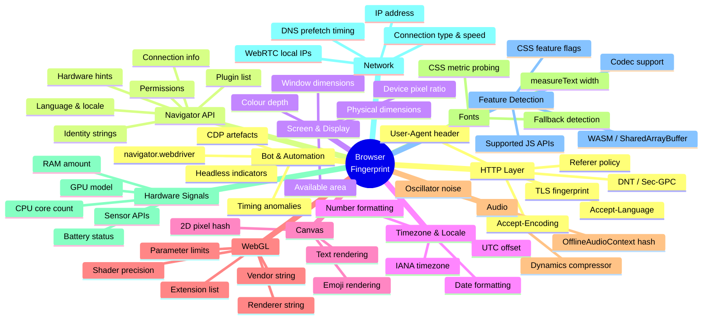

---

## Signal Collection Flow

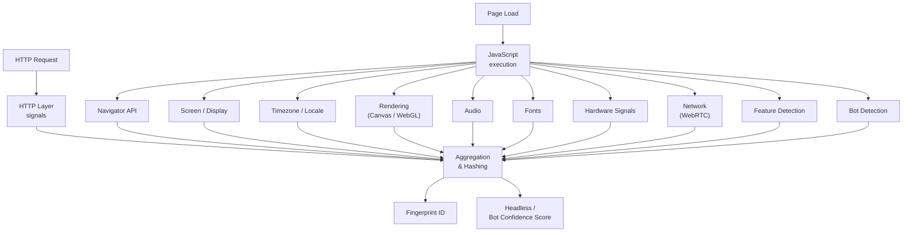

---

## 1. HTTP Layer

Collected from every request — no JavaScript needed.

| Signal | Header / Mechanism | Stable? |
|--------|-------------------|---------|
| User-Agent string | `User-Agent` | High |
| Accepted languages | `Accept-Language` | High |
| Accepted encodings | `Accept-Encoding` | Medium |
| Do-not-track intent | `DNT`, `Sec-GPC` | Low |
| HTTPS preference | `Upgrade-Insecure-Requests` | Low |
| TLS version & cipher suites | TLS handshake | High |
| TLS extension order (JA3) | TLS handshake | High |
| HTTP/2 frame settings | SETTINGS frame | High |

**TLS / JA3 fingerprint** is particularly stable because the cipher suite list and their ordering are determined by the TLS library compiled into the browser, not by JavaScript or settings.

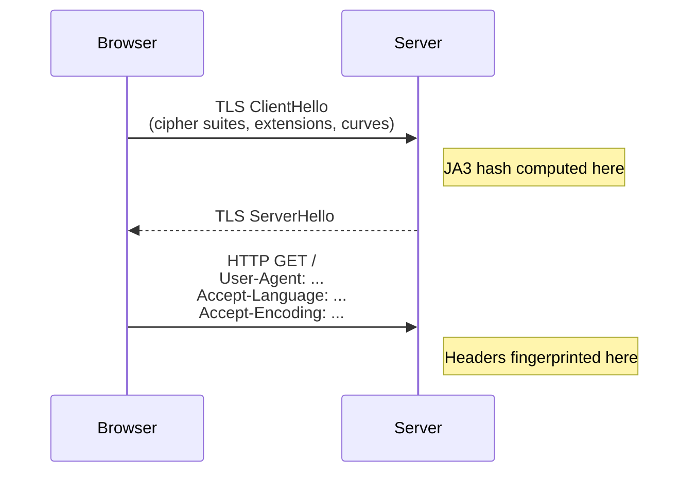

---

## 2. Navigator API

The `navigator` object exposes dozens of browser identity and capability signals.

### Identity strings

```js
navigator.userAgent          // full UA string
navigator.appVersion         // UA minus "Mozilla/"
navigator.platform           // OS platform, e.g. "Win32"
navigator.vendor             // browser vendor, e.g. "Google Inc."
navigator.vendorSub          // always ""
navigator.productSub         // build date string, e.g. "20030107"
navigator.product            // always "Gecko"
```

### Language & locale

```js
navigator.language           // primary language, e.g. "en-US"
navigator.languages          // ordered list, e.g. ["en-US", "en", "de"]
```

### Hardware hints

```js
navigator.hardwareConcurrency   // logical CPU count
navigator.deviceMemory          // RAM in GiB (rounded: 0.25–8)
navigator.maxTouchPoints        // 0 = no touchscreen
```

### Other signals

```js
navigator.cookieEnabled
navigator.pdfViewerEnabled
navigator.javaEnabled()
navigator.doNotTrack
navigator.webdriver            // true when driven by automation
navigator.onLine
navigator.connection           // effectiveType, downlink, rtt
```

### Plugin list

`navigator.plugins` returns a `PluginArray`. Real Chrome on Windows typically contains one entry (`PDF Viewer`). Headless browsers commonly return an empty list.

---

## 3. Screen & Display

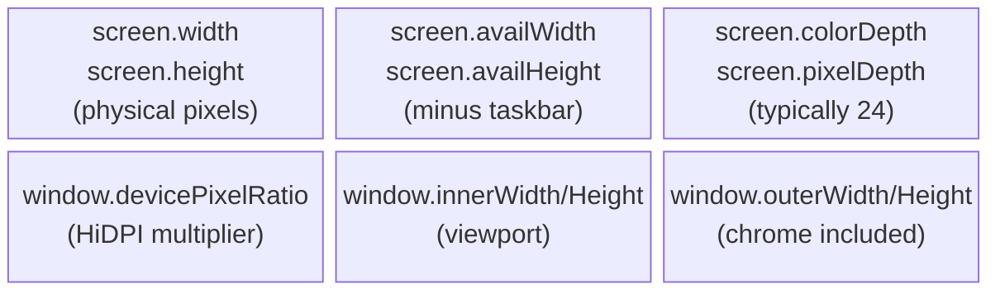

**Headless indicators:**
- `screen.width === 0` or `screen.height === 0`
- `devicePixelRatio === 1.0` on a machine expected to have HiDPI
- `innerWidth/outerWidth` ratio inconsistent with any real browser chrome size

---

## 4. Timezone & Locale

| Signal | API | Example |
|--------|-----|---------|
| IANA timezone | `Intl.DateTimeFormat().resolvedOptions().timeZone` | `"America/New_York"` |
| UTC offset (minutes) | `new Date().getTimezoneOffset()` | `300` |
| Locale date format | `new Date().toLocaleDateString()` | `"3/22/2026"` |
| Number format | `(1234.5).toLocaleString()` | `"1,234.5"` |
| First day of week | `Intl.Locale` weekInfo | `1` (Monday) |

Mismatch between the `Accept-Language` header (HTTP layer) and `navigator.language` (JS layer) is a strong bot signal.

---

## 5. Canvas Fingerprinting

Canvas rendering differs across GPU drivers, OS font renderers, and anti-aliasing implementations. The same drawing instructions produce subtly different pixels on different machines.

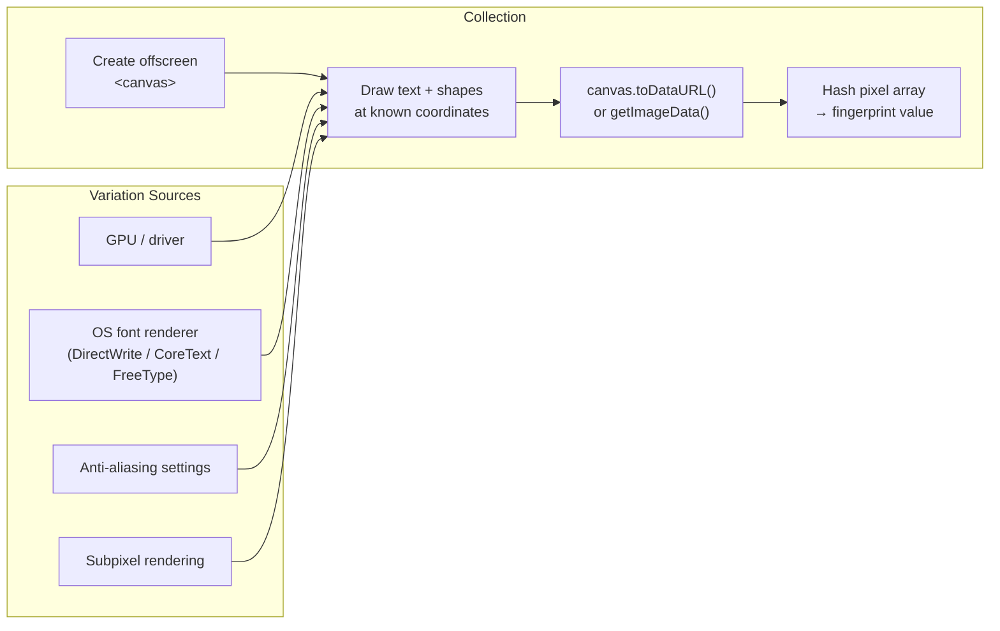

**Collected signals:**
- SHA hash of the full PNG data URL
- Individual pixel RGBA values at known positions
- Text bounding box width via `measureText()`

**Noise injection** (Nightglow's `canvas_noise_seed`): adds deterministic per-profile sub-1 LSB perturbations that make canvas hashes unique per session while remaining visually identical.

---

## 6. WebGL Fingerprinting

WebGL exposes detailed GPU information and rendering behaviour.

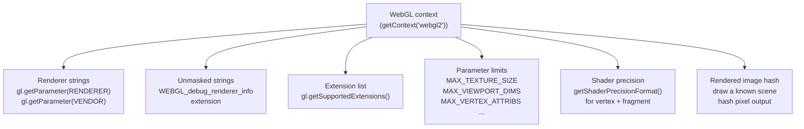

| Parameter | Example (real Chrome/NVIDIA) |
|-----------|------------------------------|
| `RENDERER` | `"ANGLE (NVIDIA, NVIDIA GeForce RTX 3070 Direct3D11 vs_5_0 ps_5_0, D3D11)"` |
| `VENDOR` | `"Google Inc. (NVIDIA)"` |
| Unmasked renderer | `"NVIDIA GeForce RTX 3070"` |
| Unmasked vendor | `"NVIDIA Corporation"` |

Headless without GPU emulation returns software renderers like `"Mesa/X.org"` or blank strings.

---

## 7. Audio Fingerprinting

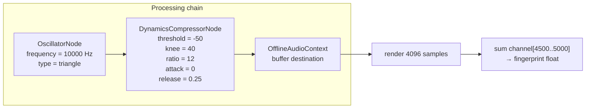

The summed sample value differs by ~0.0001 across machines due to floating-point rounding in different audio processing implementations (native vs. software DSP). The value is highly stable for a given hardware/driver combination.

**Noise injection** (Nightglow's `audio_noise_seed`): perturbs the rendered buffer values by a seeded deterministic offset below the audible threshold.

---

## 8. Font Fingerprinting

Font availability is probed by measuring rendered text width — no direct font enumeration API exists.

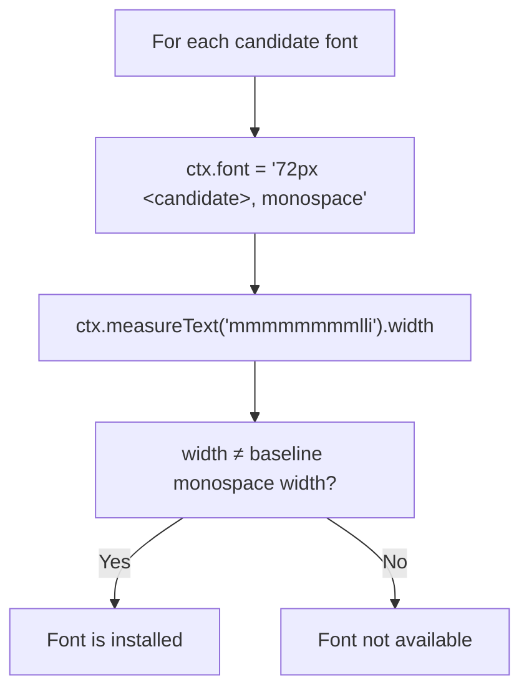

Windows, macOS, and Linux each have distinct default font sets. The intersection and difference of installed fonts is a strong OS and user-profile signal.

**Common probed fonts:** Arial, Calibri, Cambria, Comic Sans MS, Courier New, Georgia, Impact, Times New Roman, Trebuchet MS, Verdana, and 100+ others.

---

## 9. Hardware Signals

| Signal | API | Notes |
|--------|-----|-------|
| CPU logical cores | `navigator.hardwareConcurrency` | Capped at 8 in some browsers |
| RAM amount | `navigator.deviceMemory` | Rounded to nearest power of 2, max 8 GiB |
| GPU model | WebGL `WEBGL_debug_renderer_info` | Full model string |
| Battery level | `navigator.getBattery()` | Deprecated/gated in most browsers |
| Gyroscope / accelerometer | `DeviceMotionEvent` | Mobile only |
| Ambient light sensor | `AmbientLightSensor` | Rarely available |

---

## 10. Network Signals

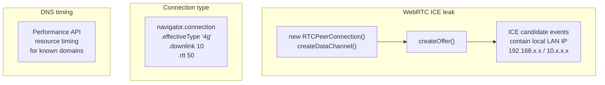

**WebRTC local IP leak** is the most impactful: even behind a proxy or VPN, the browser may emit the real local network IP via ICE candidates when establishing a peer connection.

---

## 11. Feature Detection

Supported APIs are enumerated via existence checks:

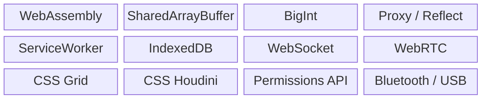

The exact combination of supported and unsupported features narrows the browser version and configuration significantly.

**Codec probing:**
```js
video.canPlayType('video/mp4; codecs="avc1.42E01E"')  // H.264
video.canPlayType('video/webm; codecs="vp9"')          // VP9
audio.canPlayType('audio/ogg; codecs="vorbis"')        // Vorbis
```

**Math constants** — floating-point results differ across architectures for:
```js
Math.tan(Math.PI / 4)      // not exactly 1.0
Math.sin(Math.PI / 6)
Math.acos(-1)
```

---

## 12. Bot & Automation Detection

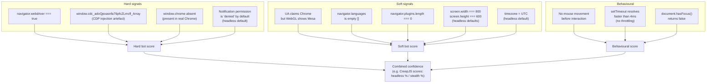

---

## Nightglow Implementation Status

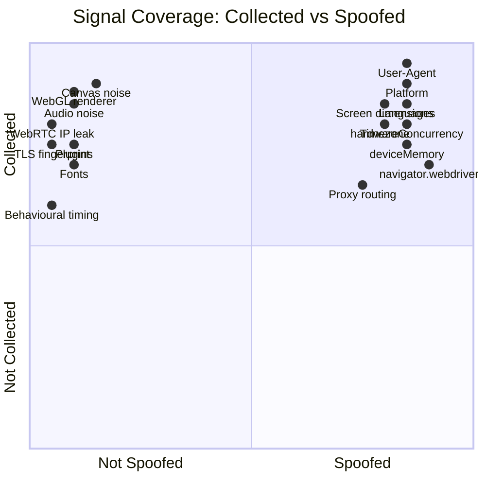

| Category | Signals collected | Spoofed by nightglow |
|----------|:-----------------:|:--------------------:|
| HTTP / User-Agent | ✓ | ✓ |
| Navigator identity | ✓ | ✓ |
| Language / locale | ✓ | ✓ |
| Hardware hints | ✓ | ✓ |
| Screen & display | ✓ | ✓ |
| Timezone | ✓ | ✓ |
| Webdriver flag | ✓ | ✓ |
| Proxy routing | ✓ | ✓ |
| Canvas pixel noise | ✓ | ✗ not implemented |
| WebGL renderer / vendor | ✓ | ✗ not implemented |
| Audio context noise | ✓ | ✗ not implemented |
| Navigator plugins | ✓ | ✗ not implemented |
| Font availability | ✓ | ✗ not implemented |
| WebRTC IP leak | ✓ | ✗ not implemented |
| TLS / JA3 | ✓ | ✗ not implemented |
| Behavioural signals | ✓ | ✗ out of scope |
