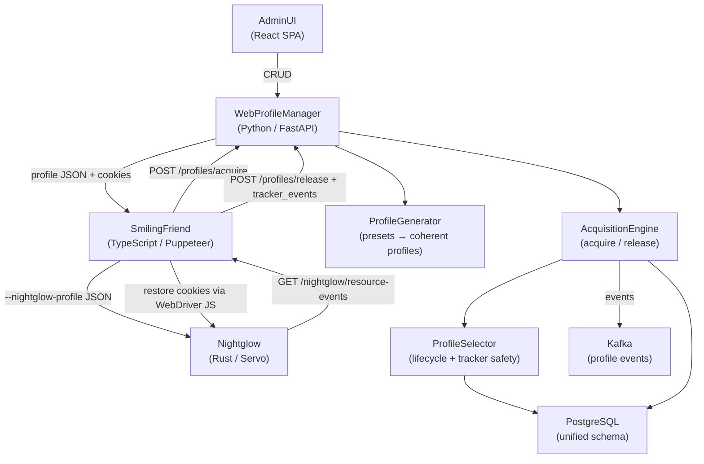
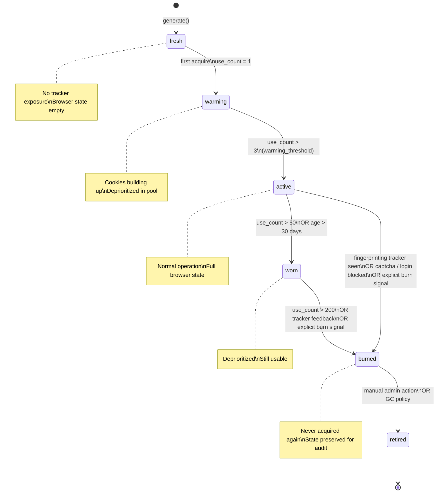
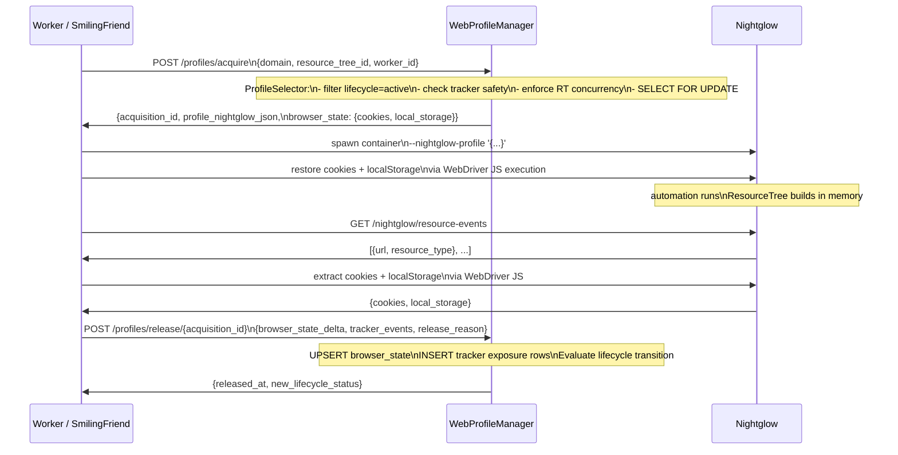
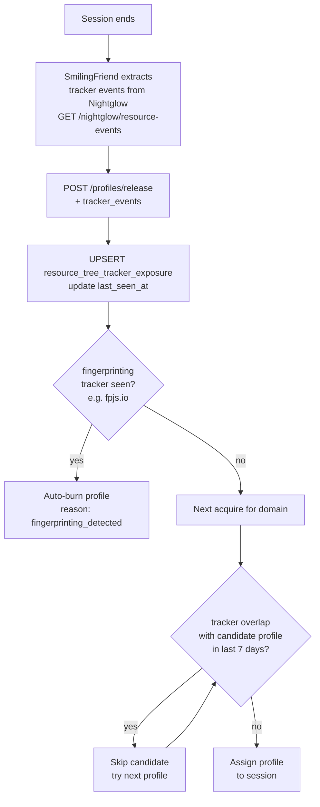
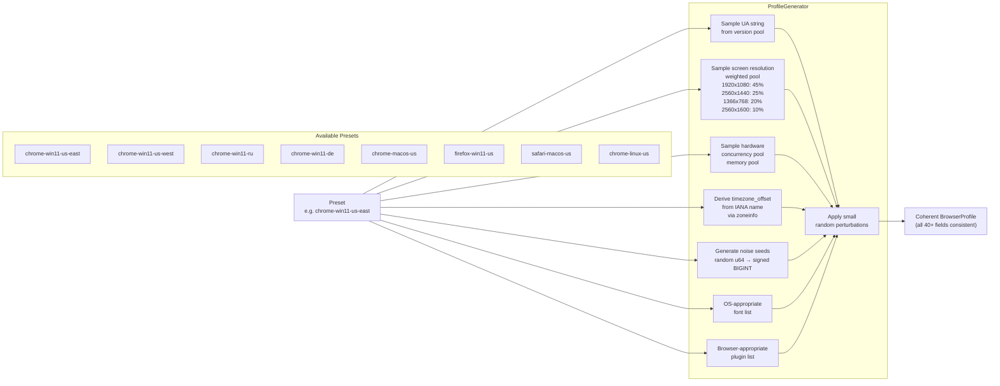

# Profile & Browser Data Management System

## Overview

Three systems manage browser profiles: **WebProfileManager** (Python/FastAPI), **SmilingFriend** (TypeScript), and **Nightglow** (Rust). This design unifies them — WPM becomes the single authority. Others call it.

---

## Data Model

```mermaid
erDiagram
    profiles {
        uuid id PK
        string name
        string description
        string preset
        enum status "active|archived"
        string user_agent
        enum platform "Win32|MacIntel|Linux x86_64"
        string app_version
        string language
        string accept_language
        string timezone
        int timezone_offset
        int screen_width
        int screen_height
        int screen_avail_width
        int screen_avail_height
        int inner_width
        int inner_height
        int outer_width
        int outer_height
        float device_pixel_ratio
        int hardware_concurrency
        float device_memory
        int max_touch_points
        bigint canvas_noise_seed
        bigint audio_noise_seed
        string webgl_vendor
        string webgl_renderer
        string webgl_unmasked_vendor
        string webgl_unmasked_renderer
        bool hide_webdriver
        enum proxy_type "none|http|socks5"
        string proxy_host
        int proxy_port
        float geo_latitude
        float geo_longitude
        float traj_jitter
        float traj_bias
        int traj_steps
        int timing_base_delay
        int timing_burst_delay
        float timing_rhythmicity
        int typing_char_delay
        float scroll_speed
    }

    profile_extras {
        uuid profile_id PK FK
        jsonb plugins
        jsonb fonts
        jsonb client_hints
        jsonb webgl_params
    }

    profile_instances {
        uuid id PK
        uuid profile_id FK
        string domain
        enum lifecycle_status "fresh|warming|active|worn|burned|retired"
        jsonb lifecycle_metadata
        int use_count
        timestamp last_used_at
        timestamp burned_at
        string burn_reason
    }

    profile_browser_states {
        uuid id PK
        uuid profile_id FK
        string domain
        jsonb cookies
        jsonb local_storage
        timestamp last_updated_at
    }

    profile_acquisitions {
        uuid id PK
        uuid profile_id FK
        uuid profile_instance_id FK
        uuid resource_tree_id FK
        string worker_id
        string session_id
        timestamp acquired_at
        timestamp expires_at
        timestamp released_at
        string release_reason
    }

    resource_trees {
        uuid id PK
        string name
        string primary_domain
        int max_concurrent
    }

    resource_tree_domains {
        uuid resource_tree_id FK
        string domain
    }

    resource_tree_tracker_exposure {
        uuid id PK
        uuid profile_id FK
        uuid resource_tree_id FK
        string tracker_origin
        enum resource_type "analytics|advertising|fingerprinting|social_media|cdn|other"
        timestamp first_seen_at
        timestamp last_seen_at
    }

    profiles ||--o| profile_extras : "side-car"
    profiles ||--o{ profile_instances : "per domain"
    profiles ||--o{ profile_browser_states : "per domain"
    profiles ||--o{ resource_tree_tracker_exposure : "exposure log"
    profiles ||--o{ profile_acquisitions : "sessions"
    profile_instances ||--o{ profile_acquisitions : "tracks"
    resource_trees ||--o{ resource_tree_domains : "contains"
    resource_trees ||--o{ profile_acquisitions : "scopes"
    resource_trees ||--o{ resource_tree_tracker_exposure : "observed in"
```

---

## Component Architecture



---

## Profile Lifecycle



---

## Acquire → Inject → Release Flow



---

## Tracker Feedback Loop



---

## Profile Generation (Presets)



---

## Migration Phases

```mermaid
gantt
    title Migration Phases
    dateFormat  X
    axisFormat Phase %s

    section Phase 1 — WPM Schema
    Add unified profiles table columns     :p1a, 0, 1
    Add profile_instances table            :p1b, 0, 1
    Add profile_browser_states table       :p1c, 0, 1
    Add resource_tree_tracker_exposure     :p1d, 0, 1
    Keep old endpoints working             :p1e, 0, 1

    section Phase 2 — WPM Acquire/Release
    Enrich acquire response (nightglow JSON + cookies)  :p2a, 1, 2
    Accept tracker_events + browser_state on release    :p2b, 1, 2
    Add ProfileGenerator + preset endpoint              :p2c, 1, 2
    Lifecycle transitions on release                    :p2d, 1, 2

    section Phase 3 — SmilingFriend Switch
    acquireAndInjectProfile calls WPM HTTP              :p3a, 2, 3
    Release path sends browser_state + tracker_events   :p3b, 2, 3
    Local Drizzle profile tables retired                :p3c, 2, 3

    section Phase 4 — Nightglow Events
    Add GET /nightglow/resource-events endpoint         :p4a, 3, 4
    SmilingFriend polls at session end                  :p4b, 3, 4
```


